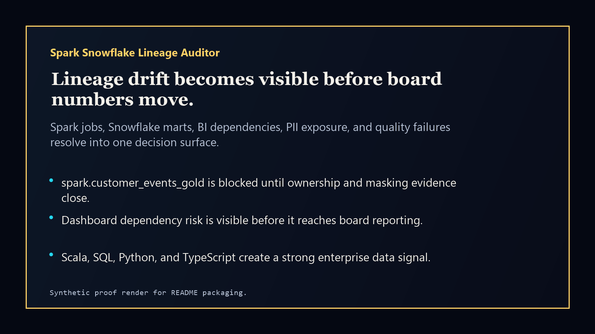
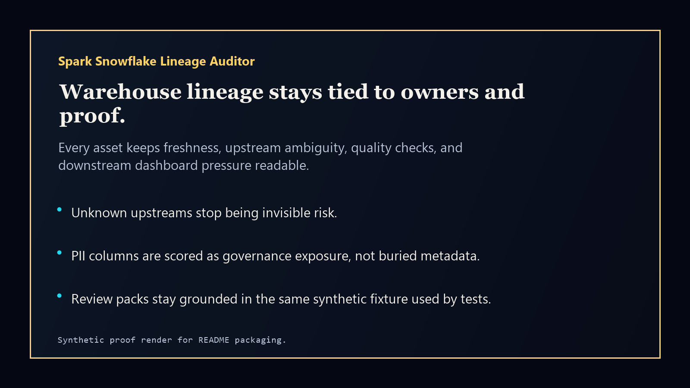

# spark-snowflake-lineage-auditor

[](https://github.com/mizcausevic-dev/spark-snowflake-lineage-auditor/actions/workflows/ci.yml)
[](https://github.com/mizcausevic-dev/spark-snowflake-lineage-auditor/actions/workflows/pages.yml)
[](LICENSE)

Spark Snowflake Lineage Auditor is a data-engineering control-plane prototype for exposing freshness drift, unknown upstreams, PII exposure, failed quality checks, and downstream dashboard dependency risk.

## Why this exists

- Executive dashboards become dangerous when lineage evidence is missing or stale.
- Spark jobs, Snowflake marts, BI dashboards, and compliance owners need the same risk posture before board numbers move.
- Data leaders need a concise answer to which asset is exposed, who owns it, and what proof is missing.

## What it ships

- TypeScript scoring library and public static console.
- Python review-pack generator.
- Snowflake SQL lineage-risk views.
- Scala risk-auditor source for Spark-style lineage scoring.
- Synthetic fixtures, docs, screenshots, and GitHub Pages release rail.

## Local run

```powershell
npm install
npm run verify
```

## Screenshots





## Security

This repo uses synthetic data only. Do not commit customer data, raw warehouse extracts, access tokens, credentials, proprietary table schemas, or private lineage exports.

